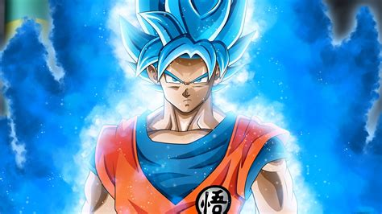

<h1>👋Hi, I’m <strong>@MatheusSamuelVinicius</strong></h1>

<ul>👀 We're interested in:
   <li>Matheus likes XBurguer;</li>
   <li>Samuel is interested in music;</li>
   <li>Vinicius dont know what he likes.</li>
</ul>
<ul>🌱 We're currently learning:
   <li>Matheus is learning the english language;</li>
   <li>Samuel is learning psychology;</li>
   <li>Vinicius is learning JavaScript.</li>
</ul>
<ul>💞️ We're looking to collaborate on:
   <li>Nothing, yet.</li>
</ul>
<!---
MatheusSamuelVinicius/MatheusSamuelVinicius is a ✨ special ✨ repository because its `README.md` (this file) appears on your GitHub profile.
You can click the Preview link to take a look at your changes.
--->
<h2>Gabriel</h2>

<h2>Samuel</h2>

